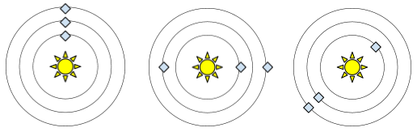
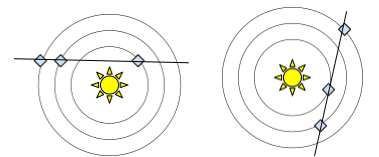
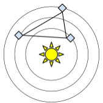

# Galaxy weather

Web service that tells you the weather of the following years in a solar system 
depending on the alignment of the planets.

## Weather
- **Dry:** If planets are aligned with the sun.  

- **Rainy:** If planets make a triangle where the sun is inside of it.  

- **Perfect:** If planets are aligned but not with the sun.  

- **Humid:** If planets make a triangle where the sun is outside of it.  


## Arquitechture
- **Backend:** Node.js (v14.15.1*), with Express (v4.17.1*) and TypeScript (v4.0.5*)
- **Data Base:** MongoDB (v4.3.3*)
- **Dependency manager:** npm (v6.14.8*)

*This are the version used during development, may work with other versions.

## Requirements
### Node.js and npm
Install Node.js which already comes with npm.
- [Node.js](https://nodejs.org/en/)
### MongoDB
Install MongoDB Community Server (Optional you can also get MongoDB Compass for a GUI).
- [MongoDB Community Server](https://www.mongodb.com/try/download/community)

## Environment
- Install all dependencies:
```
$ npm ci
```
- Create a .env file with your own configuration (Use .env.example as guide):
```
# server
SERVER_PORT=8080

# database
DB_HOST=localhost
DB_PORT=27017
DB_NAME=galaxy

# galaxy
FERENGI_DISTANCE=500
BETASOIDE_DISTANCE=2000
VULCANO_DISTANCE=1000
WEATHER_YEARS=10
```
- Check that your DB configuration matches your MongoDB Server and run:
```
$ npm start
```

## API

### /weathers
Get the weather of given "date" (DDMMYYYY)
```
http://localhost:8080/weathers?date=01102025

{
    "date": "01102025",
    "weather": "rainy",
    "rainIntensity": 6169.122598120477
}
```

### /weathers/count
Get the amount of days with given weather (dry, rainy, humid, perfect)
```
http://localhost:8080/weathers/count?weather=rainy

{
    "count": 1788
}
```

### /weathers/top-rain
Get the day with biggest rain
```
http://localhost:8080/weathers/top-rain

{
    "date": "31052021",
    "weather": "rainy",
    "rainIntensity": 6298.446243518021
}
```

## Other (demo) projects of mine with similar stack
### TPFullstack
- [Checkout the repository](https://github.com/santibozzo/TPFullstack)
- **Backend:** Node.js with Express
- **Frontend:** React
- **Data base:** MongoDB
- **Hosting:** Hosted in an AWS EC2 (Amazon Linux)
- **Unit testing:** Mocha with Supertest
- **Dependency manager:** npm